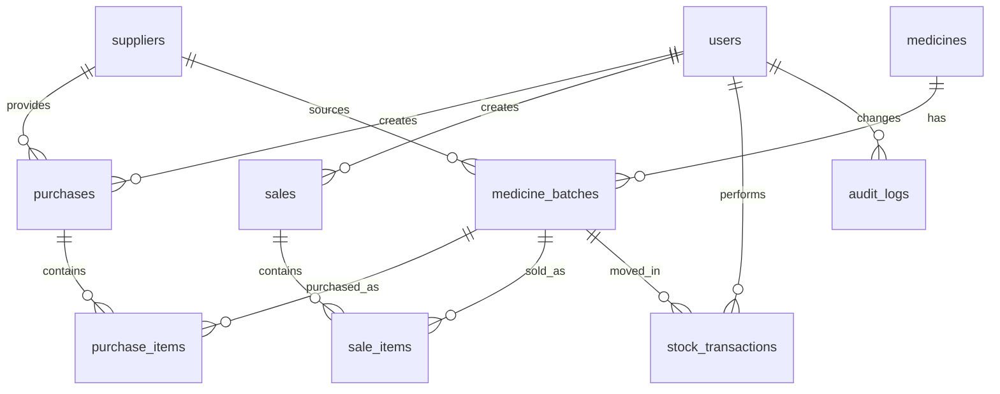

# Day 2 ER Diagram

```mermaid
erDiagram
    users ||--o{ purchases : creates
    users ||--o{ sales : creates
    users ||--o{ stock_transactions : performs
    users ||--o{ audit_logs : changes

    suppliers ||--o{ purchases : provides
    suppliers ||--o{ medicine_batches : sources

    medicines ||--o{ medicine_batches : has

    purchases ||--o{ purchase_items : contains
    medicine_batches ||--o{ purchase_items : purchased_as

    sales ||--o{ sale_items : contains
    medicine_batches ||--o{ sale_items : sold_as

    medicine_batches ||--o{ stock_transactions : moved_in
```
